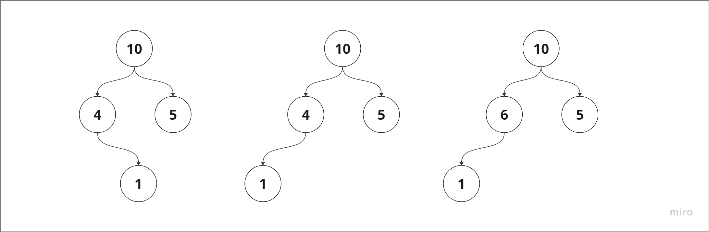

# Automatic Test Oracle Generation

---

## Task 1

### Question:
Can we automatically compare two random objects using `equals` method? If not, try to come up with an example when
equals will not work.

### Answer:

In case of comparing instances of standard classes, e.g. `String`, `Integer/int`, etc., there is an overridden method `equals` defined in standard library to produce meaningful results. Thus, comparison via `equals` with these classes works as expected.

In case of user-defined classes (not considering extension of standard classes with an overridden method `equals`) the default behavior of `equals` (the method inherited from the `Object` class) compares the actual addresses of the instances in memory, thus the comparison of 2 distinct objects that are logically considered equivalent in fact results in `false`.

Thus, the user-defined implementation of `equals` (that conforms to **equivalence relation**) is implied below. 

Another issue might arise in case of one of the compared objects being `null`, which results in `NullPointerException` if `equals` is called on a null-object:

```java
MyClass1 obj1 = null;
MyClass1 obj2 = new MyClass1();

obj1.equals(obj2); // Error: 'NullPointerException'
```

Thus, either the `Objects.equals(obj1, obj2)` should be used or the case of `obj1` being `null` should be treated manually.

In case of comparing instances of 2 unrelated classes (in terms of inheritance) and wrongly implemented `equals` of both classes the results may change if the order of parameters changes:

```java
public class Main {
    static private class B {
        public int value = 0;

        // Accepting only instances of B
        @Override
        public boolean equals(Object other) {
            if (other instanceof B o) {
                return o.value == this.value;
            }
            return false;
        }
    }

    static private class A {
        public int value = 0;

        // Accepting instances of either A or B
        @Override
        public boolean equals(Object other) {
            if (other instanceof B o) {
                return o.value == this.value;
            }
            if (other instanceof A o) {
                return o.value == this.value;
            }
            return false;
        }
    }

    public static void main(String[] args) {
        A a = new A();
        a.value = 10;

        B b = new B();
        b.value = 10;

        System.out.println(Objects.equals(a, b)); // true
        System.out.println(Objects.equals(b, a)); // false
    }
}
```

**Overall, the quick answer:** the ability to make the comparison of 2 random objects exists, i.e. just call `Objects.equals(a, b)`, since this approach is `null`-error-free and is independent of the order of the parameters if `equals` for provided objects conforms to the equivalence relation. If instances of 2 unrelated (in terms of inheritance) are compared the result may be not obvious and may change with the change of the order of the parameters.  


## Task 2

### Question:

Do you have any alternative ideas of how we can compare two random objects for equality? Explain their pros and cons

### Answer:

1. Override `equals` method:
   1. Pros:
      1. Control over comparison logic
      1. Compatible with standard API: if the `equals` implementation conforms the before mentioned requirements it can be integrated with standard containers (i.e. all the algorithms, such as sorting, will work correctly).
   1. Cons:
      1. Manual implementation is time-consuming.
      1. Potential for mistakes since the requirements of `equals` (especially in case of complex class hierarchy) are complicated.
1. Use of **Comparator**:
   1. Pros:
      1. We can define several comparators for the same classes.
      2. The comparison logic is decoupled from the classes.
   1. Cons:
      1. Troubles using standard containers since by default they rely on the `equals` method.
      1. We need to create a new Comparator class for each object comparison policy.
1. Serialization and Deserialization:
   1. Pros:
      1. If Serialization and Deserialization are implemented the comparison between objects is a comparison of the content of 2 byte arrays which is trivial.
      1. Works for any objects that could be serialized (sort of type-independent).
   1. Cons:
      1. If objects are huge Serialization and Deserialization may be time-consuming and inefficient.
      1. If Serialization and Deserialization do not consider all the details of objects (e.g. some members ignored) the results may be not accurate (bytes of 2 objects may be the same but the initial objects were not).
      1. Extremely error prone and hard to debug.

I would personally stick to the 1st option since it is a mainstream, and there is a lot of manuals and instructions of how to implement it correctly.

## Task 3

### Question:

Given a representation of a binary tree, write a function that will determine whether two binary trees have similar contents (for some definition of similarity, do not forget to also explain how you defined similarity).

### Answer:

**Def:** by similarity of two binary trees let's consider the equivalence of the trees' structure and the values of the corresponding nodes.

For instance, all the trees of the following image are not similar because they either have different values of nodes or the structure is not the same.



Implementation:

```java
class BinaryTree {
   int value;
   BinaryTree left;
   BinaryTree right;
   
   static boolean contentsSimilar(BinaryTree lhv, BinaryTree rhv) {
        if (lhv == null && rhv == null) {
            return true;
        }
        if (lhv == null || rhv == null) {
            // either left or right is null, but not both
            return false;
        }
        
      boolean leftSubtreesSimilar = contentsSimilar(lhv.left, rhv.left);
      boolean rightSubtreesSimilar = contentsSimilar(lhv.right, rhv.right);
      
      return lhv.value == rhv.value && leftSubtreesSimilar && rightSubtreesSimilar;
   }
   
   // You can consider that these methods are implemented
   // and you can use them if needed
   boolean contains(int value);
   boolean add(int value);
   boolean remove(int value);
   int size();
}
```

**Possible improvement:** before calling `contentsSimilar` recursively we may check whether sizes of left and right subtrees are the same by calling `size()` method (assuming `size()` requires `O(1)` of time) because inequality of sizes implies inequality of the subtrees' structure, but the improvement requires messy checks for `[lhv|rhv].left` and `[lhv|rhv].right` being `null`.

**Time complexity:** we traverse the structure of the smaller binary tree, thus the time complexity is `O(n)`.